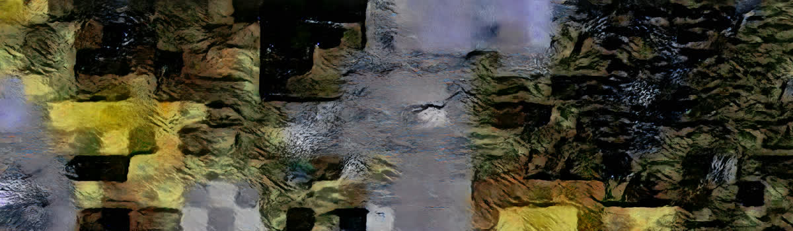

# Terrain-Dreamer: Procedural Terrain Generation




**Terrain-Dreamer** is a novel approach to procedural terrain generation that places key tiles on a tilemap and fills in the gaps using inpainting models. This allows for smooth transitions between different biomes.

## 🛠️ Requirements

- Clone the repository and install it as a package:
  ```bash
  git clone https://github.com/ruipreis/terrain-dreamer.git
  cd terrain-dreamer
  pip install .
  ```
- Download the available checkpoints if you want to experiment without training the models from scratch.
- For manually downloading and processing the original dataset, ensure you have access to a service account with Google Earth API access.

## 🌍 Dataset

The ALOS World 3D - 30m (AW3D30) is a global Digital Elevation Model (DEM) produced by the Japan Aerospace Exploration Agency (JAXA), offering 30-meter resolution digital surface and terrain models worldwide.

### Downloading the Dataset

You can download the dataset from the original source or use our prepared dataset with satellite and depth data in NPZ files, split into training and testing sets. The prepared dataset is available [here](https://storage.googleapis.com/terrain-generation-models/AW3D30.zip).

### Preparing the Dataset

To download the dataset from the official source:
- Visit the [AW3D30 data page](https://www.eorc.jaxa.jp/ALOS/en/aw3d30/data/index.htm).
- Example download link for the area between N075W030 and N080W025: [N075W030_N080W025.zip](https://www.eorc.jaxa.jp/ALOS/aw3d30/data/release_v2012/N075W030_N080W025.zip).

Alternatively, use the following script to automatically download AW3D30 data and obtain corresponding satellite imagery from the Google Earth API:
1. Download the AW3D30 data:
    ```bash
    python terrdreamer/dataset/aw3d30.py
    ```
2. Obtain matching satellite imagery:
    ```bash
    python terrdreamer/dataset/gearth.py
    ```

### Documentation

For more information about the AW3D30 dataset, refer to the official [documentation](https://www.eorc.jaxa.jp/ALOS/en/aw3d30/aw3d30v3.2_product_e_e1.0.pdf).


## 🧠 Models

We use four models to achieve our results:
- **image-to-dem**: A [pix2pix](https://arxiv.org/abs/1611.07004) Conditional GAN that converts RGB data to a DEM.
- **dem-to-image**: A pix2pix model that converts DEM data to RGB data.
- **image generation**: A [ProGAN](https://arxiv.org/abs/1710.10196) to generate novel satellite imagery.
- **inpainting**: An inpainting model based on [Generative Image Inpainting with Contextual Attention](https://arxiv.org/abs/1801.07892), used to predict masked parts of satellite data.

## 🎓 Training

Training scripts use `wandb` for experiment tracking. Ensure `wandb` is installed and configured.

### Inpainting Model Training

To train the inpainting model:
```bash
python terrdreamer/models/infinity_grid/train.py \
    --train-dataset aw3d30/train \
    --test-dataset aw3d30/test \
    --limit 10000 \
    --save-model-path checkpoints/inpainting \
    --wandb-project inpainting
```


### Checkpoints

Download checkpoints for all models:
```bash
mkdir -p checkpoints
wget https://storage.googleapis.com/terrain-generation-models/checkpoints.zip -P checkpoints
unzip checkpoints/checkpoints.zip -d checkpoints
```

## 🖼️ Inference

To generate a tile map:
1. Initialize a Qdrant container:
    ```bash
    docker pull qdrant/qdrant
    docker run -p 6333:6333 qdrant/qdrant
    ```
2. Populate the Qdrant vector database with randomly generated satellite imagery:
    ```bash
    python terrdreamer/grid/__init__.py
    ```
3. Create real and fake tiles:
    ```bash
    python terrdreamer/grid/generate.py --height 10 --width 50
    ```
4. Interpolate between placed tiles:
    ```bash
    python terrdreamer/grid/interpolation.py --height 10 --width 50
    ```
5. Fill gaps with inpainting:
    ```bash
    python terrdreamer/grid/filling.py --height 10 --width 50
    ```
6. Estimate depth for image tiles:
    ```bash
    python terrdreamer/grid/depth.py
    ```
7. Convert to image format:
    ```bash
    python terrdreamer/grid/to_image.py
    ```

## 🌟 Inspiration

This project is inspired by the following works by [Emmanouil Panagiotou](https://github.com/Panagiotou):
- **image-to-dem**: [Generating Elevation Surface from a Single RGB Remotely Sensed Image Using Deep Learning](https://github.com/Panagiotou/ImageToDEM).
- **dem-to-image**: [Procedural 3D Terrain Generation using Generative Adversarial Networks](https://github.com/Panagiotou/Procedural3DTerrain).